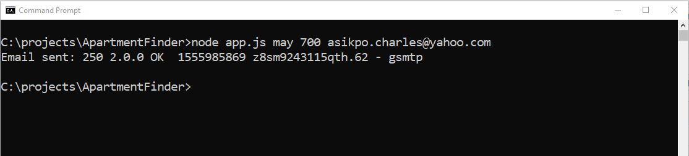

A node script that scrape apartments off kijiji based on month of availability. With this script, you can pass the desired month of availability for apartments amongst other arguments. It emails you with a list of potential apartments found based on the search criterias that was passed. 

How to run

 - Fork or download this repo
 
 - Install node. You can use this link https://www.guru99.com/download-install-node-js.html
 
 - After installation, you should be able to run node from windows command line
 
 - To run the script, type node "app.js" 'month' 'max_price' 'email' as shown below
 
 
   
   
 Limitations: it currently only searches for apts in Montreal as this was the initial purpose for the script. But its a very trivial modification to make it generic, location wise. Feel free to modify this to suite your desires!  
